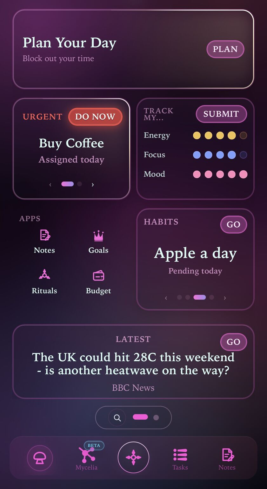
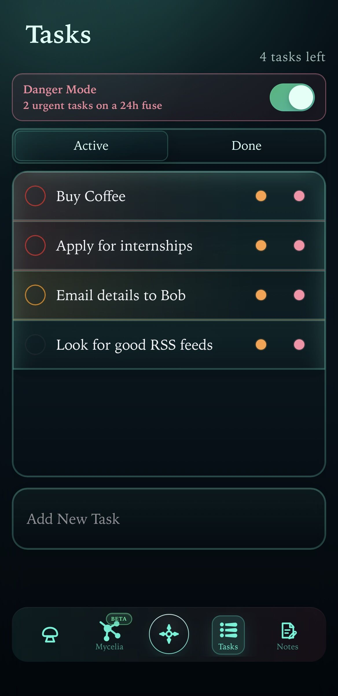
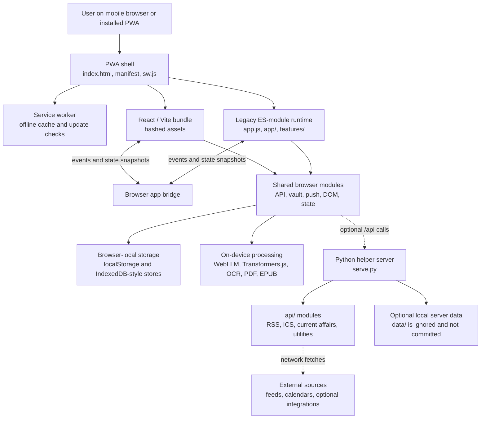

# Cordyceps Public v1

Cordyceps is a mobile-first personal productivity PWA. This repository is a clean-history public snapshot of the v1 application that was being served at `https://cordyceps.app` when exported.

This public repository contains the built v1 web artifact plus a sanitized snapshot of the Python helper server used by optional `/api/*` features. It intentionally excludes private git history, local runtime secrets, deployment keys, server data, and the separate v2 rewrite.

## Screenshots

Screenshots from the original [Cordyceps LinkedIn post](https://www.linkedin.com/feed/update/urn:li:activity:7470379073429725184/).

<p>
  
  
</p>

## What It Does

Cordyceps combines a daily command surface with local-first productivity tools:

- Dashboard for tasks, rituals, habits, calendar signals, reading, and app launchers.
- Task and habit workflows with priority, urgency, completion state, and streak-style feedback.
- Ritual and planning surfaces for daily routines and must-do items.
- Notes, books, RSS reading, Tamil learning, budget views, and wellness tools.
- Mycelia and Thendral experimental AI surfaces, including browser-local model support where available.
- PWA installation, offline shell caching, app icons, update metadata, and service worker lifecycle support.

The app is designed to keep the core user experience in the browser. Most personal state is stored locally through browser storage and IndexedDB-style stores, with optional helper APIs used for features that need server-side assistance.

## Architecture Diagram



## Repository Shape

```text
.
├── index.html                 # PWA entrypoint and boot/landing gate
├── manifest.webmanifest       # Install metadata
├── sw.js                      # Service worker and cache/update behavior
├── version.json               # Public scrubbed build metadata
├── app.js                     # Legacy v1 application runtime
├── app/                       # Legacy feature modules
├── modules/                   # Shared browser modules: API, DOM, vault, push, state
├── features/                  # Legacy feature modules for books, notes, RSS, markdown
├── assets/                    # Vite chunks, React bundle, AI workers, fonts, images
├── vendor/                    # Bundled OCR, PDF, and EPUB runtime dependencies
├── fonts/                     # Font files and licenses
├── icons/                     # PWA and app icons
├── styles*.css                # Shell, page, theme, and bundled CSS
├── serve.py                   # Optional Python helper server and local static host
├── api/                       # Helper modules for RSS, calendar parsing, current affairs, utilities
├── requirements.txt           # Python dependencies for the helper server
├── .env.example               # Placeholder-only environment template
├── tests/                     # Safe backend regression tests
└── docs/screenshots/          # Public PWA screenshots
```

## Runtime Architecture

Cordyceps v1 is a hybrid frontend:

- **React/Vite bundle**: the modern UI layer is emitted into hashed files under `assets/`.
- **Legacy ES-module runtime**: `app.js`, `app/`, `modules/`, and `features/` keep older app state and feature behavior alive.
- **Bridge model**: React views and legacy modules share browser events and state snapshots, so newer surfaces can coexist with older modules.
- **Local-first storage**: core productivity data is stored in browser-local storage mechanisms. User data is not bundled in this repository.
- **Service worker**: `sw.js` caches the shell and runtime assets, handles app update metadata, and bypasses `/api/` network requests.
- **Optional helper APIs**: `serve.py` provides server-assisted routes for RSS parsing, article extraction, current affairs data, calendar parsing, push setup, and legacy/self-hosted integrations.

At a high level:

```text
Browser UI
  -> React/Vite chunks in assets/
  -> Legacy app runtime in app.js and app/
  -> Shared modules for local store, vault, API, push, DOM, state
  -> Browser storage and IndexedDB-style local persistence
  -> Optional Python /api/* helper service
  -> Service worker cache and update flow
```

## Helper Backend

`serve.py` is the optional backend helper. In the original private repository it served `web/dist`; in this public snapshot it falls back to serving the repository root so the exported static artifact can run without rebuilding.

The helper is intentionally configurable through environment variables. Optional integrations that need credentials, such as banking, Outlook, SMTP, push, or PostgreSQL-backed account/state paths, require values supplied by the operator and are not bundled here. The core PWA remains local-first and does not need those credentials.

Included backend modules:

- `api/rss.py`: RSS/Atom feed fetching and article-reader extraction with URL safety checks.
- `api/ics.py`: iCalendar/ICS parsing and timezone normalization helpers.
- `api/current_affairs.py`: current-affairs source and graph helpers.
- `api/utils.py`: shared text, datetime, and HTML utilities.

The frontend may call routes such as:

- `/api/rss/...` for feed and reader helpers.
- `/api/push/...` and `/api/alerts/...` for push notification setup.
- `/api/outlook/...` for calendar integration.
- `/api/banking/...` and `/api/monzo/...` for banking import flows.
- `/api/current-affairs/...` and `/api/notification-scheduler` for experimental features.
- `/api/state`, `/api/client-state`, and `/api/tasks` for legacy/self-hosted state paths.

Core static UI and local-first behavior can be inspected without the helper server. Features requiring `/api/` need `serve.py` or a compatible implementation.

## On-Device AI and Local Processing

The public artifact includes browser-side AI and document-processing dependencies:

- `assets/myceliaWebLlmWorker-*.js` for WebLLM worker execution.
- `assets/transformers.web-*.js` for Transformers.js-style browser inference.
- `assets/ort-wasm-*.wasm` for ONNX Runtime Web.
- `vendor/ocr/` for Tesseract OCR assets.
- `vendor/pdfjs/` for PDF extraction.
- `vendor/epubjs/` for EPUB reading.

These assets support local processing paths, but actual model availability depends on browser support, device capability, network access to model providers, and feature configuration.

## Running Locally

For the full public snapshot, create a Python environment and run the helper server:

```bash
python3 -m venv .venv
. .venv/bin/activate
pip install -r requirements.txt
python serve.py --host 127.0.0.1 --port 4176
```

Then open:

```text
http://127.0.0.1:4176/?app=1
```

For a static-only preview, serve the repository root:

```bash
python3 -m http.server 8080
```

Then open:

```text
http://127.0.0.1:8080/?app=1
```

Static-only mode is enough to inspect the PWA shell and local browser workflows, but optional `/api/*` features will not be available.

The `?app=1` query opens the app shell directly. Without it, the public landing/install gate may be shown depending on browser mode.

Do not open `index.html` directly from the filesystem. The app expects a web origin so ES modules, service workers, absolute asset paths, and browser storage behave consistently.

## Deployment

Any static host that serves this repository root at `/` can host the v1 artifact. To enable helper routes, run `serve.py` as an application process or proxy `/api/` to an equivalent backend.

Important deployment notes:

- Serve `index.html` for unknown app routes.
- Serve `sw.js` with `Cache-Control: no-cache`.
- Serve `version.json` with `Cache-Control: no-cache, no-store, must-revalidate`.
- Serve hashed files under `assets/` with long-lived immutable caching.
- Proxy `/api/` to a compatible backend only if optional helper features are needed.
- Keep `.env`, generated keys, and server data outside the public static root. The included helper also blocks common local-only files from static serving.

Example nginx shape:

```nginx
root /path/to/cordyceps-public;

location = /sw.js {
    add_header Cache-Control "no-cache";
}

location = /version.json {
    add_header Cache-Control "no-cache, no-store, must-revalidate";
}

location /assets/ {
    expires 1y;
    add_header Cache-Control "public, immutable";
}

location / {
    try_files $uri $uri/ /index.html;
}
```

## Privacy and Security Notes

This repository was exported without git history and without private runtime files. It does not include `.env` files, private keys, local push state, server databases, source maps, or deployment credentials.

The included `version.json` has public-safe metadata only. The private release manifest and release-signing metadata were omitted because they describe the original deployment pipeline and would not remain valid after sanitization.

`.env.example` is placeholder-only. The `.gitignore` excludes local environment files, virtualenvs, generated VAPID keys, helper data under `data/`, caches, and test artifacts. If you self-host the helper, prefer process-level environment variables or a private `.env` outside any public static root.

## Scope

This is v1 only. The separate Cordyceps v2 rewrite, account system, realtime sync backend, and private deployment infrastructure are intentionally outside this repository.
